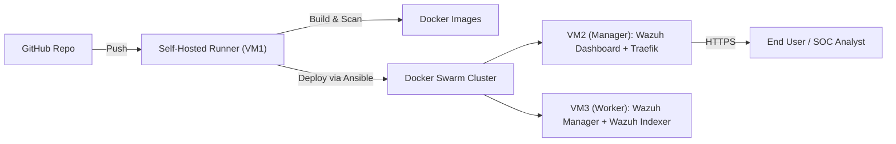

# 🛡️ Mini SOC – Wazuh on Docker Swarm with CI/CD

Welcome to **Mini SOC** 🚀 – a hands-on project to deploy the **Wazuh SIEM stack** on **Docker Swarm** with a modern **CI/CD pipeline**.  
This repo shows how to build, scan, test, and deploy Wazuh securely using **GitHub Actions**, **Ansible**, and **Traefik**.

---

## ✨ Features

- 🐳 **Wazuh Stack** – Manager, Indexer, and Dashboard  
- 🔒 **HTTPS** with Traefik (using a self-signed cert)  
- 📦 **CI/CD pipeline** – Build → Trivy Scan → Selenium & API tests → Deploy with Ansible  
- 🗂️ **Persistent storage** with Docker volumes  
- 🔑 **Secrets management** with GitHub Secrets, Ansible Vault, and Swarm Secrets  
- 🛠️ **Rollback support** with Docker Swarm  
- ✅ **Quality gates** with Trivy, yamllint, and ansible-lint  

---

## 🏗️ Architecture Overview

### Infrastructure
- **VM1 (AWS)** → GitHub Actions **Self-Hosted Runner**  
  - Dependencies: Python 3.12, Ansible 2.18.8, Docker 28.3.3, Trivy 0.65.0  
- **VM2 (AWS)** → **Docker Swarm Manager + Wazuh Manager + Dashboard + Traefik**  
- **VM3 (AWS)** → **Docker Swarm Worker + Wazuh Indexer**    

### Diagram



### Services
- **Wazuh Stack**: Indexer, Manager, Dashboard  
- **Traefik**: Reverse proxy, HTTPS termination (self-signed certificates)  
- **Persistent Volumes**: Wazuh data stored in Docker volumes  

### Data Flow
1. CI/CD pipeline checks first YAML synatx and ensures ensures Ansible logic is correct.
2. Self-hosted runner builds and scans Docker images.  
3. Ansible deploys the Wazuh stack to Docker Swarm.  
4. Traefik exposes the Wazuh dashboard securely over HTTPS.  
5. Selenium tests validate dashboard accessibility and login form.  
6. API tests validate Wazuh Manager health.  

---

## ⚙️ CI/CD Pipeline

### Stages
1. **Lint** → Check YAML syntax and Ansible-specific rules
2. **Build** → Build container images  
3. **Scan** → Scan with **Trivy**, fail on High/Critical vulnerabilities  
4. **Deploy** → Deploy stack to Swarm with **Ansible**  
5. **Tests** → Run Selenium (HTTPS validation) + API probes  

> Tests are executed **after deployment** since HTTPS validation requires running services.

---

## 📂 Repository Structure

```

.github/workflows/ci-cd.yml           # CI/CD pipeline
ansible/
├─ inventories/production/
│   ├─ group\_vars/all.yml
│   ├─ group\_vars/vault.yml
│   └─ hosts.yml
├─ playbooks/deploy.yml
├─ playbooks/teardown.yml
└─ roles/
├─ swarm-init/
├─ networks/
├─ secrets/
├─ deploy-stack/
└─ traefik/
docker/Dockerfile                     # Custom vulnerable image for Trivy demo
stack/wazuh-stack.yml                 # Wazuh stack for Swarm
security/tls/traefik/traefik.yml      # Traefik static config
security/tls/traefik/dynamic.yml      # Traefik dynamic TLS config
security/tls/policy.md                # Security policy
tests/
├─ selenium/test\_dashboard.py        # Selenium dashboard tests
├─ selenium/requirements.txt
└─ api/test\_health.py                 # Wazuh API probe
trivy/trivy.yaml                      # Trivy config
trivy/.trivyignore
.ansible-lint.yml
.yamllint
README.md

```

---

## ⚡ Getting Started

### 1. Clone the Repo

```bash
git clone https://github.com/AshBloom12/Mini_SOC.git
cd mini-soc
```

---

### 2. Set Up Inventory

Edit `ansible/inventories/production/hosts.yml` with your VM IPs:

```yaml
all:
  children:
    nodes:
      hosts:
        node1:   # Dashboard node (also Swarm manager)
          ansible_host: 10.0.1.44

        node2:   # Manager/indexer node
          ansible_host: 10.0.2.30
```

---

### 3. Secrets

Add the following GitHub Encrypted Secrets:

* `WAZUH_DASHBOARD_URL`
* `WAZUH_API_URL`
* `WAZUH_API_USER`
* `WAZUH_API_PASS`
* `ANSIBLE_VAULT_PASSWORD`

⚠️ Do **not** hardcode secrets (username, password, TLS certificate and TLS private key). Use `group_vars/vault.yml` (encrypted with Ansible Vault).

```bash
ansible--vault create ansible/inventories/production/group_vars/vault.yml
```

---

## 🔒 TLS & Security

- **TLS Termination**: Managed by **Traefik** (self-signed certificates)  
- Config files:  
  - `security/tls/traefik/traefik.yml`  
  - `security/tls/traefik/dynamic.yml`  

- **Policies**: Vulnerability scanning enforced via `trivy/trivy.yaml` and `trivy/.trivyignore`  
- Config: `trivy/trivy.yaml`
- Ignore list: `trivy/.trivyignore`
- CI fails on **Critical/High** vulnerabilities

Example:

```bash
trivy image --exit-code 1 --severity CRITICAL,HIGH image:tag
```

- **Linting**: `.ansible-lint.yml` and `.yamllint` ensure code quality 

---

## 🧪 Testing

### Selenium (UI)

* Validates HTTPS reachability of Dashboard
* Checks page title + login form

Run locally:

```bash
pip3 install -r tests/selenium/requirements.txt
pytest -q tests/selenium/test_dashboard.py
```

### API Health

* Hits Wazuh API at `${WAZUH_API_URL}`
* Asserts `200 OK` and JSON response

Run:

```bash
pytest -q tests/api/test_health.py
```

---

## 🚀 Deployment

### 1️⃣ Deploy Stack

Deploy the Wazuh stack to your Docker Swarm cluster using Ansible:

```bash
ansible-playbook -i ansible/inventories/production/hosts.yml ansible/playbooks/deploy.yml
```

**Prerequisites:**

* `hosts.yml` must contain correct IPs of VM2 (Manager) and VM3 (Worker).
* Ansible Vault password must be set (`ANSIBLE_VAULT_PASSWORD`) to decrypt secrets.
* The machine running this command (e.g., self-hosted runner) must have **Ansible installed** and **SSH access** to VM2/VM3.

---

### 2️⃣ Teardown Stack

Remove the deployed stack and clean up resources:

```bash
ansible-playbook -i ansible/inventories/production/hosts.yml ansible/playbooks/teardown.yml
```

**Prerequisites:**

* Same as deploy: Ansible installed, SSH access to VM2/VM3, Vault password available.
* The Swarm cluster must be reachable and running (VM2 Manager + VM3 Worker).
* This playbook safely removes the stack, networks, and secrets.

---

### 3️⃣ Rollback (Conceptual Guidance)

Docker Swarm supports rollback to the previous working version if a service update fails.

* Automatic rollback happens on failed updates.
* Manual rollback example for a specific service:

```bash
docker service update --rollback <service_name>
```

Or, to redeploy a previous image version:

```bash
docker stack deploy -c stack/wazuh-stack.yml <stack_name>
```

**Notes:**

* Replace `<service_name>` and `<stack_name>` with actual names.
* Rollback requires knowing the previous image tag or service version.
* This is **not a single command you can blindly run** after cloning.

---

## 📸 Evidence to Collect

* ✅ Screenshots of pipeline runs
* ✅ Wazuh dashboard (mask creds)
* ✅ Trivy report sample
* ✅ Ansible deploy output

---

## 📌 Assumptions

* DNS/IPs are reachable from your runner
* Security groups allow 443 (HTTPS) + Swarm ports
* Self-hosted runner (VM1) can SSH into VM2 & VM3
* Versions used: Python 3.12, Ansible 2.18.8, Docker 28.3.3, Trivy 0.65.0

---

## 🛡️ Security Notes

* No plaintext secrets in Git
* Secrets rotated via GitHub Actions & Vault
* TLS keys restricted on VM2
* Non-admin accounts used for tests

---

## ✅ Summary

This Mini SOC project demonstrates:

* Secure CI/CD with GitHub Actions
* Automated deployment to Docker Swarm
* Wazuh SIEM with Traefik TLS termination
* Secure secrets management & vulnerability scanning
* Automated validation via Selenium & API tests

---